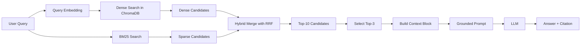

# Architecture - RAG Pipeline (Day 08 Lab)

> Template: Điền vào các mục này khi hoàn thành từng sprint.
> Deliverable của Documentation Owner.

## 1. Tổng quan kiến trúc

```
[Raw Docs]
    ↓
[index.py: Preprocess → Chunk → Embed → Store]
    ↓
[ChromaDB Vector Store]
    ↓
[rag_answer.py: Query → Retrieve → Rerank/Select → Generate]
    ↓
[Grounded Answer + Citation]
```

**Mô tả ngắn gọn:**
> Nhóm xây dựng một hệ thống RAG nội bộ cho CS/IT Helpdesk để trả lời câu hỏi về policy, SLA, access control, FAQ và HR policy dựa trên tài liệu công ty. Pipeline lấy tài liệu text đã chuẩn hóa, tách chunk có metadata, lưu vào ChromaDB, sau đó truy xuất bằng dense hoặc hybrid retrieval và sinh câu trả lời có citation. Mục tiêu chính là tăng khả năng trả lời đúng tài liệu nguồn và biết từ chối khi context không đủ.

---

## 2. Indexing Pipeline (Sprint 1)

### Tài liệu được index
| File | Nguồn | Department | Số chunk |
|------|-------|-----------|---------|
| `policy_refund_v4.txt` | `policy/refund-v4.pdf` | CS | 6 |
| `sla_p1_2026.txt` | `support/sla-p1-2026.pdf` | IT | 5 |
| `access_control_sop.txt` | `it/access-control-sop.md` | IT Security | 7 |
| `it_helpdesk_faq.txt` | `support/helpdesk-faq.md` | IT | 6 |
| `hr_leave_policy.txt` | `hr/leave-policy-2026.pdf` | HR | 5 |

### Quyết định chunking
| Tham số | Giá trị | Lý do |
|---------|---------|-------|
| Chunk size | 400 tokens (ước lượng bằng ký tự/4) | Bám đúng khuyến nghị 300-500 tokens của lab, đủ chứa một điều khoản/section ngắn mà chưa làm context quá dài |
| Overlap | 80 tokens | Giữ liên kết giữa các đoạn khi một section dài bị tách thành nhiều chunk |
| Chunking strategy | Heading-based trước, sau đó paragraph-based nếu section dài | Ưu tiên ranh giới tự nhiên theo `=== Section ... ===` hoặc `=== Phần ... ===`, giảm việc cắt giữa điều khoản |
| Metadata fields | `source`, `section`, `department`, `effective_date`, `access` | Phục vụ filter, freshness, debug, citation và đánh giá coverage |

### Embedding model
- **Model**: `text-embedding-3-small`
- **Vector store**: ChromaDB (`PersistentClient`)
- **Similarity metric**: Cosine

**Đánh giá Sprint 1:**
> Indexing pipeline đã hoàn thiện ở mức usable: parse metadata từ header, chunk theo heading/paragraph, tạo embedding và upsert vào ChromaDB. Tổng cộng hệ thống index 29 chunks trên 5 tài liệu, đủ để chạy retrieval và evaluation end-to-end. Điểm mạnh là metadata khá đầy đủ; điểm cần lưu ý là overlap hiện vẫn cắt theo ký tự nên đôi lúc chưa thật "mượt" ở biên paragraph dài.

---

## 3. Retrieval Pipeline (Sprint 2 + 3)

### Baseline (Sprint 2)
| Tham số | Giá trị |
|---------|---------|
| Strategy | Dense (embedding similarity) |
| Top-k search | 10 |
| Top-k select | 3 |
| Rerank | Không |

### Variant (Sprint 3)
| Tham số | Giá trị | Thay đổi so với baseline |
|---------|---------|------------------------|
| Strategy | Hybrid (Dense + BM25 + RRF) | Bổ sung sparse retrieval để bắt exact keyword/alias |
| Top-k search | 10 | Giữ nguyên để đảm bảo A/B chỉ đổi retrieval strategy |
| Top-k select | 3 | Giữ nguyên |
| Rerank | Có, nhưng chỉ là sort theo score hiện có | Không phải cross-encoder thật; chủ yếu đóng vai trò top-k select |
| Query transform | Không | Giữ nguyên để giảm nhiễu trong A/B |

**Lý do chọn variant này:**
> Nhóm chọn hybrid retrieval vì corpus có cả câu tự nhiên và keyword chuyên ngành như `P1`, `SLA`, `Approval Matrix`, `Flash Sale`, `license key`. Dense retrieval phù hợp với paraphrase, còn BM25 hỗ trợ exact match và alias tốt hơn. Đây cũng là variant đã được cài trực tiếp trong `rag_answer.py`, nên có thể đánh giá bằng scorecard thực tế thay vì chỉ mô tả ý tưởng.

**Đánh giá Sprint 2 + 3:**
> Về mặt kỹ thuật, baseline dense và variant hybrid đều chạy end-to-end. Tuy nhiên, variant hiện chưa tạo cải thiện rõ rệt trên bộ test: context recall giữ nguyên 5.0/5 nhưng faithfulness và completeness giảm nhẹ do hybrid đôi lúc kéo thêm chunk liên quan nhưng không đúng trọng tâm, đặc biệt ở câu hỏi alias/escalation. Điều này cho thấy bottleneck không còn nằm ở recall thô mà nằm ở khâu chọn đúng evidence và khống chế generation.

---

## 4. Generation (Sprint 2)

### Grounded Prompt Template
```
You are a professional and helpful AI Assistant for the Internal CS & IT Helpdesk.
Answer strictly from the retrieved context.
If the context is insufficient, say you do not have enough data.
You must cite sources using [1], [2], ...
Always answer in Vietnamese unless the user asks otherwise.

Question: {query}

Retrieved Context:
[1] {source} | {section} | {department} | {effective_date} | score={score}
{chunk_text}

[2] ...

Final Answer:
```

### LLM Configuration
| Tham số | Giá trị |
|---------|---------|
| Model | `gpt-4o-mini` (mặc định qua `LLM_MODEL`) |
| Temperature | 0 |
| Max tokens | 600 |

**Đánh giá generation:**
> Prompt đã có đủ 4 nguyên tắc của grounded generation: evidence-only, abstain, citation, output ổn định. Ở các câu hỏi có bằng chứng rõ ràng, generation hoạt động tốt và thường trả lời đầy đủ kèm citation. Điểm yếu là khi context chứa thông tin liên quan nhưng không khớp chính xác câu hỏi, model đôi lúc abstain quá sớm (`q04`, `q10`) hoặc diễn giải dư từ chunk retrieve được (`q07` trong variant).

---

## 5. Failure Mode Checklist

> Dùng khi debug - kiểm tra lần lượt: index → retrieval → generation

| Failure Mode | Triệu chứng | Cách kiểm tra |
|-------------|-------------|---------------|
| Index lỗi | Retrieve về docs cũ / sai version | `inspect_metadata_coverage()` trong `index.py` |
| Chunking tệ | Chunk cắt giữa điều khoản hoặc alias bị tách khỏi câu giải thích | `list_chunks()` và đọc preview của chunk |
| Retrieval lệch trọng tâm | Có đúng source nhưng lấy nhầm section, trả lời lan sang thông tin phụ | `score_context_recall()` trong `eval.py` kết hợp soi `chunks_used` |
| Generation abstain quá tay | Có source đúng nhưng vẫn trả lời "không đủ dữ liệu" | So sánh `answer` với `expected_answer` ở `results/scorecard_*.md` |
| Generation bị thêm diễn giải | Trả lời đúng tài liệu nhưng thêm suy diễn ngoài context | `score_faithfulness()` trong `eval.py` |
| Token overload / context nhiễu | Context dài khiến model chọn nhầm evidence chính | Kiểm tra `build_context_block()` và số chunk được select |

**Failure modes đã quan sát được trong scorecard hiện tại:**
> `q04` và `q10` cho thấy pipeline có thể retrieve đúng source nhưng vẫn thất bại ở bước kết luận câu trả lời, nhất là khi câu hỏi đòi suy luận "không có chính sách riêng" hoặc đọc mục ngoại lệ. `q06` và `q07` ở variant cho thấy hybrid retrieval chưa đủ để đảm bảo chọn đúng câu trọng tâm nếu không có rerank mạnh hơn.

---

## 6. Diagram (tùy chọn)



---

## 7. Kết luận kiến trúc

> Kiến trúc hiện tại đã đủ hoàn chỉnh để demo một hệ thống RAG nội bộ nhỏ với indexing, dense/hybrid retrieval, generation và evaluation. Baseline dense đang ổn định hơn variant hybrid trên bộ câu hỏi hiện có, nên nếu cần một cấu hình mặc định cho demo thì nên ưu tiên dense + grounded prompt. Hướng cải thiện tiếp theo hợp lý nhất là rerank thật sự theo query-chunk relevance hoặc query transformation cho alias, thay vì chỉ cộng thêm hybrid retrieval.
